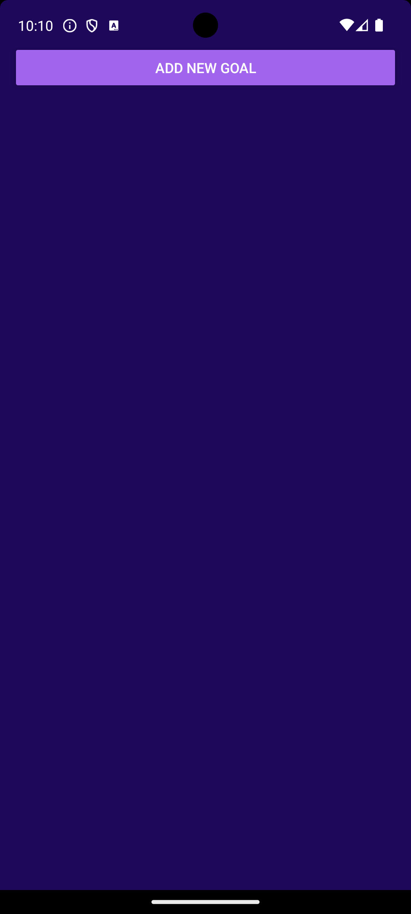
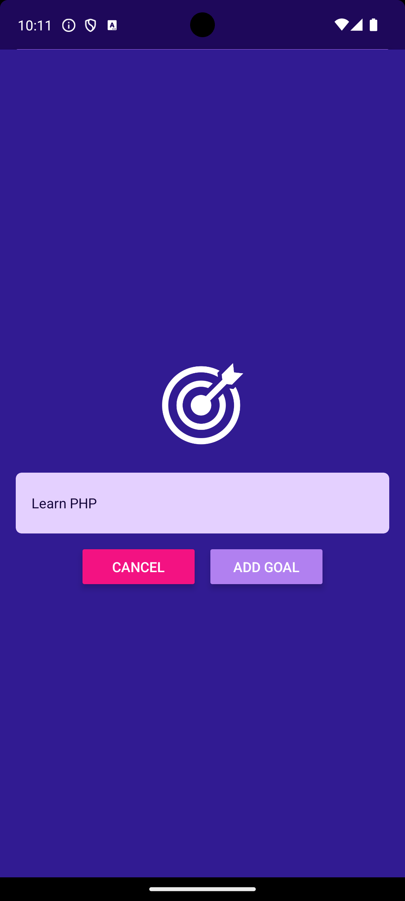
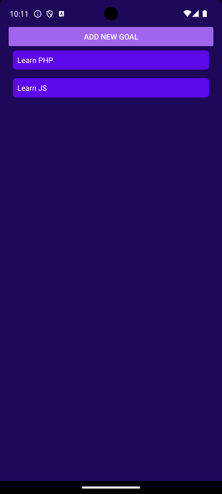
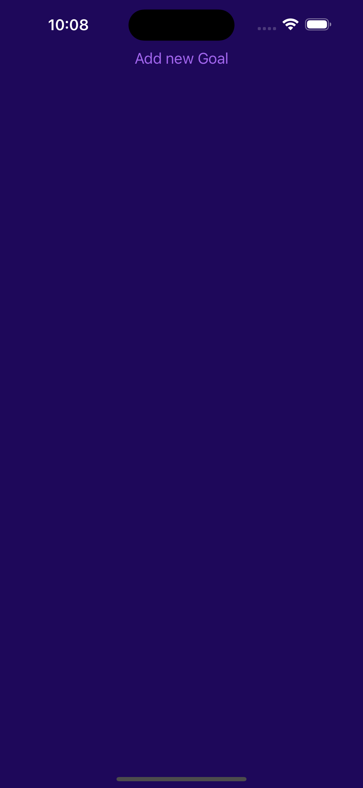
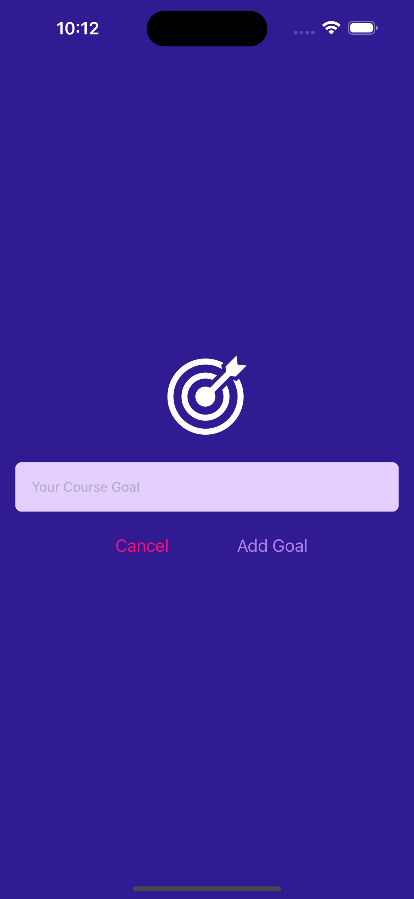
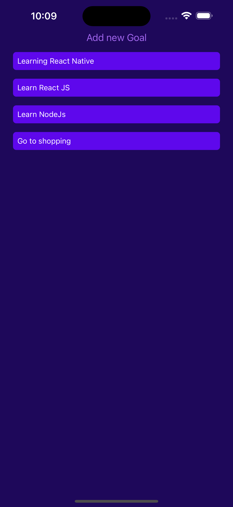

# React Native Goal Tracker App

This React Native app allows users to seamlessly add and delete their goals, helping them stay organized and on track.

## Features

- Add goals
- Delete goals
- View a list of all goals

## Screenshots

- Android

1. Home Screen
   

2. Add Goal Screen
   

3. Home Screen With Goals
   

- iOS

1. Home Screen
   

2. Add Goal Screen
   

3. Home Screen With Goals
   

## Installation

Follow these steps to set up and run the app locally.

### Prerequisites

Ensure you have the following installed on your machine:

- [Node.js](https://nodejs.org/) (version 14 or higher)
- [npm](https://www.npmjs.com/) or [Yarn](https://yarnpkg.com/)
- [React Native CLI](https://reactnative.dev/docs/environment-setup)
- [Android Studio](https://developer.android.com/studio) (for Android development)
- [Xcode](https://developer.apple.com/xcode/) (for iOS development on macOS)

### Install Expo Globally

```sh
npm install -g expo-cli
```

### Steps

1. **Clone the repository:**

   ```sh
   git clone https://github.com/sayuj1/react-native-goal-app.git
   cd react-native-goal-app
   ```

2. **Install dependencies:**
   Using npm:

```sh
npm install
```

3. **Start the Metro bundler:**

```sh
npm start
```

4. **Run the app:**

- For Android:

Make sure you have an Android emulator running or an Android device connected via USB debugging.

```sh
Press a
```

- For iOS:

Make sure you have an iOS simulator running or an iOS device connected.

```sh
Press i
```

## Contributing

Contributions are welcome! Please fork the repository and submit a pull request.

## License

This project is licensed under the MIT License. See the LICENSE file for details.

## Contact

For any inquiries, please contact sayuj.sehgal@gmail.com
